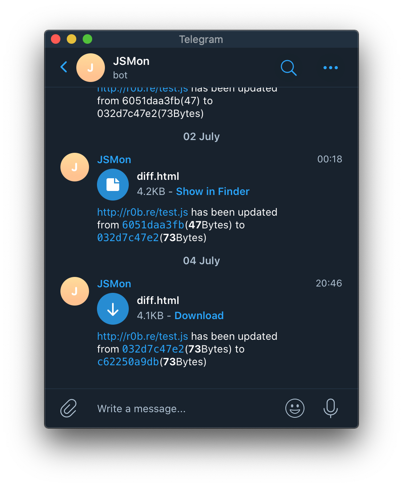
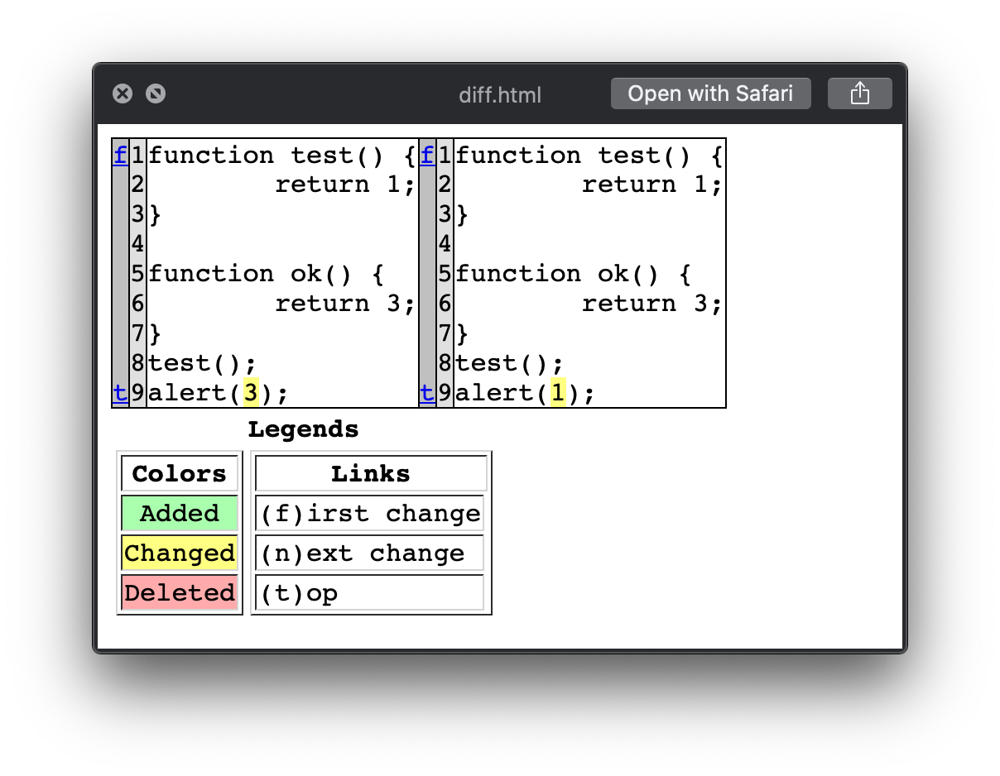

# JSMon
JSMon - JavaScript Change Monitor for BugBounty

Using this script, you can configure a number of JavaScript files on websites that you want to monitor. Everytime you run this script, these files will be fetched and compared to the previously fetched version. If they have changed, you will be notified via Telegram with a message containing a link to the script, the changed filesizes, and a diff file to inspect the changes easily.





## Installation

To install JSMon:
```bash
git clone https://github.com/robre/jsmon.git 
cd jsmon
python setup.py install
```
You need to set up your Slack or Telegram token in the Environment, e.g. by creating a `.env` File:
`touch .env`
With The Contents:
```
JSMON_NOTIFY_TELEGRAM=True
JSMON_TELEGRAM_TOKEN=YOUR TELEGRAM TOKEN
JSMON_TELEGRAM_CHAT_ID=YOUR TELEGRAM CHAT ID
#JSMON_NOTIFY_SLACK=True
#JSMON_SLACK_TOKEN=sometoken
#JSMON_SLACK_CHANNEL_ID=somechannel
```
To Enable slack, uncomment the slack lines in the env and add your token.

To create a cron script to run JSMon regularly:
```
crontab -e
```

create an entry like this:
```
@daily /path/to/jsmon.sh
```
Note that you should run the `.sh` file, because otherwise the environment will be messed up.

This will run JSMon once a day, at midnight.
You can change ``@daily`` to whatever schedule suits you. 

To configure Telegram notifications, you need to add your Telegram API key and chat_id to the code, at the start of `jsmon.py`. You can read how to get these values [here](https://blog.r0b.re/automation/bash/2020/06/30/setup-telegram-notifications-for-your-shell.html).


Lastly, you need to get started with some targets that you want to monitor. Lets create an example:
```
echo "https://cdnjs.cloudflare.com/ajax/libs/jquery/3.5.1/jquery.js" >> targets/cdnjs-example
```
All done ! now you can run `python jsmon.py` to download the specified files for the first time!

## Features

- Keep Track of endpoints - check them in a configurable interval (using cron)
- when endpoints change - send a notification via Telegram or Slack


## Usage

- Provide Endpoints via files in `targets/` directory (line seperated endpoints)
    - any number of files, with one endpoint per line
    - e.g. one file per website, or one file per program, etc.
- Every endpoint gets downloaded and stored in downloads/ with its hash as file name (first 10 chars of md5 hash)
    - if it already exists nothing changes
    - if it is changed, user gets notified
- jsmon.json keeps track of which endpoints are associated with which filehashes

- jsmon is designed to keep track of javascript files on websites - but it can be used for any filetype to add endpoints 


## Contributors
[@r0bre](https://twitter.com/r0bre) - Core

[@Yassineaboukir](https://twitter.com/Yassineaboukir) - Slack Notifications

